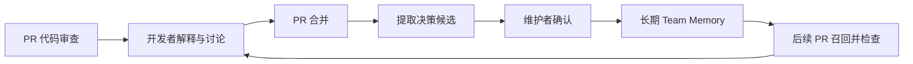

# Pi Repository Governance Agent — MVP PRD

版本：v0.1｜日期：2026-09-10｜状态：待评审草案

> 本文只定义产品目标、MVP 范围、用户行为、核心功能和验收标准。架构、Memory、GitHub 接入、可靠性与安全分别见同目录其他文档。

## 1. 产品定义

### 1.1 一句话定义

一个基于 Pi Agent 和 GitHub App 的团队级代码仓库治理 Agent：自动审查 PR，从已合并 PR 的代码与讨论中提取工程决策，将确认后的决策保存为团队 Memory，并在后续 PR 审查中复用。

GitHub 是当前唯一接入平台，统一使用 PR 术语。

### 1.2 核心价值闭环

**Review + Remember：审查变更、记住决策。**



产品价值以“已有团队决策是否能在后续 PR 中被正确召回和应用”为核心指标，而不是评论数量、Agent 数量或 Memory 数量。

### 1.3 要解决的问题

| 团队问题 | 对应能力 | 预期价值 |
| --- | --- | --- |
| 相同问题反复依赖资深成员指出 | PR Review + Team Memory | 减少重复审查工作 |
| 架构取舍散落在历史 PR 与评论中 | Decision Extractor | 保留决策、理由和来源 |
| 通用 AI 不理解团队约定 | 按仓库、模块和技术栈检索 Memory | 给出符合团队规则的建议 |
| 旧规范和局部例外被误用 | Memory 生命周期与作用域 | 区分有效规则、历史规则和有限例外 |

## 2. 用户与使用场景

### 2.1 用户角色

| 角色 | 主要操作 | 产品应提供的结果 |
| --- | --- | --- |
| PR 作者 | 提交代码、阅读评论、解释设计 | 有代码证据的审查意见 |
| Reviewer / 技术负责人 | 审核建议、确认规则与例外 | 可追溯的团队决策 |
| 仓库维护者 | 启用仓库、配置范围、管理 Memory | 可控的自动化治理行为 |
| 服务管理员 | 配置 GitHub App、模型、预算和日志 | 可观测、可暂停、可排障的服务 |

初期面向一个团队的少量 GitHub 仓库试用，优先验证 Java 后端项目。

### 2.2 核心用户故事

1. PR 作者提交或更新 PR 后，系统结合调用关系和团队约定给出有依据的审查意见。
2. Reviewer 在 PR 中明确的工程决策，能在合并后被提取为候选 Memory。
3. 维护者可以确认、拒绝、编辑候选 Memory，并控制其作用域。
4. 后续 PR 违反已确认规则时，系统能够召回对应 Memory 并引用来源。
5. 局部例外只能作用于指定仓库、模块、路径或条件，不能自动升级为全局规则。

## 3. MVP 范围

### 3.1 M0：技术链路验证

必须完成：

- GitHub App 安装与仓库授权。
- Webhook 验签与事件路由。
- PR opened / reopened / synchronize / ready_for_review 触发审查。
- 准备固定 base/head SHA 的只读代码上下文。
- Pi PR Review Agent 生成摘要 Review。
- 服务端校验后向 GitHub 发布 COMMENT Review。

M0 允许使用内存队列，仅用于证明链路成立。

### 3.2 M1：核心 MVP

在 M0 基础上完成：

- PR Review Agent 完整审查能力。
- Decision Extractor。
- Team Memory 候选、确认、检索、替代与废弃。
- PostgreSQL 持久任务记录。
- 最小 React 管理界面。
- Review 时按作用域召回 ACTIVE Memory。
- 任务去重、旧提交处理、失败恢复和权限边界。

### 3.3 后续阶段

M2：Reply Handler、Main Agent、delegate_agent、专项 SubAgent。

M3：Health Auditor、定时与手动仓库健康检查。

### 3.4 当前不做

- 冗余代码、死代码、AI 中间文件、重复文档或孤立文件清理。
- Repository Curator、Cleanup PR。
- 自动修改业务代码、自动修复、自动提交、自动推送、自动合并。
- 自动 APPROVE 或 REQUEST_CHANGES。
- Issue 管理、GitLab 接入、跨组织知识共享。
- 图数据库、独立向量数据库、复杂工作流平台、提前拆分微服务。
- 常驻且无限积累上下文的 Main Agent Session。

## 4. 功能需求

### F01｜仓库接入与配置

维护者安装 GitHub App 并选择授权仓库。M1 支持：

- 启停仓库审查。
- 设置包含 / 排除路径。
- 查看连接状态。
- 设置任务预算与输出语言。

默认建议：

- 跳过 Draft PR；转为 Ready 后审查。
- 跳过二进制和明确生成文件。
- 不因 PR 作者是依赖更新机器人而直接忽略。

暂停仓库后停止接收新的治理任务，并取消尚未发布的审查结果。

**验收：**只有已授权且已启用仓库可触发治理；暂停后不再发布新评论；缺失权限显示具体原因。

### F02｜PR 自动审查

触发事件：

- `pull_request.opened`
- `pull_request.reopened`
- `pull_request.synchronize`
- `pull_request.ready_for_review`

输入：

- PR 描述。
- 固定 base/head SHA。
- 完整变更清单和 diff。
- 必要的仓库源码与历史。
- 此前 AI 审查结果。
- 匹配当前作用域的 ACTIVE Memory。

审查维度：

| 维度 | 审查重点 |
| --- | --- |
| 正确性 | 边界条件、异常路径、状态变化、调用链影响 |
| 安全性 | 鉴权、敏感信息、注入风险、不安全数据处理 |
| 架构 | 模块边界、依赖方向、已确认架构取舍 |
| 可维护性 | 复杂度、耦合和表达问题 |
| 团队规范 | 当前仓库和模块适用的有效规则 |
| 历史决策冲突 | 是否违背已有决策，是否存在适用例外 |

执行要求：

1. 围绕当前变更追踪相关实现，不把无关的全仓库问题加入本次评论。
2. 新提交后必须重新验证受影响调用关系，不能只机械查看新增行。
3. 每条 finding 包含位置、影响、代码或规则证据、建议；严重度与证据充分程度分开记录。
4. 同一问题多处出现时聚合；已有线程中的同一问题优先更新状态。
5. 优先使用现有 lint、编译或 CI 证据，不宣称运行过未执行的检查。
6. 超大 PR、缺失源码、截断 diff 或预算不足时，明确已检查和未检查范围。
7. “未发现问题”必须附带检查范围，不代表安全或正确性保证。

输出：

- 一份 PR Review 摘要。
- 可可靠映射到 diff 的行内意见。
- 无法可靠定位的 finding 放入摘要，并附源码依据。

**验收：**给定包含已确认规则冲突的测试 PR，系统能指出具体代码并引用正确 Memory；相同事件不重复 Review；旧 head 的结果不会作为最新结论发布。

### F03｜合并后的决策提取

仅在 `pull_request.closed && merged=true` 时触发。

读取：

- 最终变更。
- PR 描述。
- 审查意见。
- 人类讨论。
- 对应合并代码快照。

提取类型：

- 架构决策。
- 工程规则。
- 安全规则。
- 编码约定。
- 有限例外。
- 废弃模式。

每条候选必须包含：

- 决策是什么，以及为什么。
- 适用仓库、路径、语言或条件。
- 人类讨论和代码位置证据。
- 属于通用规则、局部例外还是一次性实现选择。
- 与现有规则的重复、冲突或替代关系。

不提取：寒暄、重复意见、未定论猜测；也不把“代码当前恰好这么写”自动当成团队规则。

默认生效策略：

```text
Merged PR
  ↓
Decision Extractor
  ↓
CANDIDATE
  ↓ Maintainer Confirm
ACTIVE
```

高 confidence 不能绕过人工确认。

**验收：**已合并 PR 中存在明确工程决策时生成带来源和作用域的 CANDIDATE；未合并 PR 不生成正式候选；同一来源重复执行不重复新增。

### F04｜Team Memory 管理与检索

维护者可以：

- 查看候选及来源。
- 编辑措辞与作用域。
- 确认或拒绝候选。
- 废弃旧规则。
- 用新规则替代旧规则。

常规 Review 只允许 ACTIVE 且符合当前作用域的 Memory 作为团队约定依据。

初期默认按仓库隔离，不因为语义相似自动跨仓库引用。

**验收：**规则确认后可在后续相关 PR 中召回；SUPERSEDED、DEPRECATED、REJECTED 不作为现行要求；其他模块或团队的规则不会进入审查依据。

### F05｜最小管理界面

GitHub PR 是开发者主要交互入口；React 管理界面只承担治理管理。

| 页面 | M1 最小内容 |
| --- | --- |
| 仓库设置 | 接入状态、启停、路径范围、语言和预算 |
| 任务记录 | 仓库/PR、SHA、状态、耗时、失败原因、结果链接、人工重试 |
| Team Memory | 查询、来源、确认、编辑、拒绝、替代、废弃 |

界面可展示分析记录、工具执行摘要、引用来源和模型用量，但不暴露模型内部思维过程。

## 5. 产品原则

- GitHub 一级事件由代码确定性路由，不调用 LLM。
- Pi 负责推理，不负责 Webhook 验签、权限判断、任务幂等或规则生效。
- Agent 默认只读源码和 Memory。
- GitHub 发布、Memory 激活等副作用由服务端校验后执行。
- Memory 只有经维护者确认后才能成为 ACTIVE 团队规则。
- Session 是任务上下文，Team Memory 是长期工程知识，两者必须分离。

## 6. MVP 端到端验收

### 核心闭环

PR A：

1. Reviewer 在讨论中明确：“对外 DTO 字段不使用 Optional”。
2. PR 合并。
3. Decision Extractor 生成 CANDIDATE。
4. Maintainer 确认，规则转为 ACTIVE。

PR B：

1. 再次出现同作用域内的 DTO Optional。
2. PR Review Agent 召回该 ACTIVE Memory。
3. Review 指出具体代码冲突。
4. Review 引用 PR A 的 Memory 来源。

这个闭环跑通，M1 的核心产品价值成立。

### 其他关键验收

| 编号 | 场景 | 通过条件 |
| --- | --- | --- |
| AC01 | 授权仓库创建非 Draft PR | 后台完成分析并发布摘要 Review |
| AC02 | 重放同一事件 / 等价事件 | 不产生重复 Review |
| AC03 | 审查期间推送新提交 | 旧结果作废，新 head 有有效任务 |
| AC04 | Draft → Ready → Draft | 仅可审查状态执行并发布 |
| AC05 | 合并含明确决策的 PR | 生成带来源、证据、作用域和理由的 CANDIDATE |
| AC06 | 激活规则后再次违反 | 成功召回并引用来源 |
| AC07 | 替代 / 废弃 / 拒绝规则 | 失效或不适用规则不作为现行要求 |
| AC08 | 未合并或无可复用决策 | 不生成有效团队规则；允许零候选 |
| AC09 | 服务重启 / GitHub 响应丢失 | 任务可恢复，不盲目重复评论 |
| AC10 | 签名错误 / 跨仓库 Memory / 恶意仓库指令 | 拒绝越权或无效行为 |
| AC11 | diff 不完整 / 模型超时 | 显示 partial / failed 和未检查范围 |

## 7. 试用指标

指标均为待基线验证的初期目标，不代表现有能力或普适承诺。

| 指标 | 初期目标建议 |
| --- | --- |
| Webhook 响应 | P95 < 3 秒，且满足 GitHub 10 秒内响应要求 |
| 审查时延 | 对选定 ≤20 个文本文件、≤1,000 行变更样本，P95 ≤ 5 分钟 |
| 审查有效率 | 人工确认为正确且可操作的 finding ≥ 80% |
| Memory 适用召回 | 固定场景样本 ≥ 90%，并报告无关规则引用率 |
| 重复与过期评论 | 验收样本为 0 |
| 可恢复性 | 所有恢复验收场景通过 |
| 成本 | 每个任务可查询模型、Token、时长与费用，并受预算限制 |

## 8. 相关设计文档

- [architecture.md](./architecture.md)：系统架构、Agent 角色、工具边界、输出契约与技术选型。
- [memory-design.md](./memory-design.md)：Memory 数据模型、状态流转、作用域、检索与 Session 边界。
- [github-integration.md](./github-integration.md)：GitHub App、Webhook、事件、权限、Review 发布与上下文获取。
- [reliability-security.md](./reliability-security.md)：任务幂等、恢复、重试、工作区隔离、数据与安全边界。
