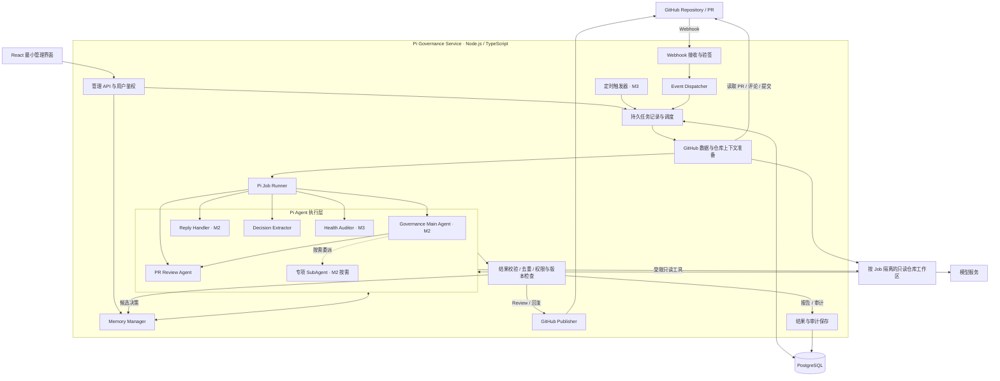
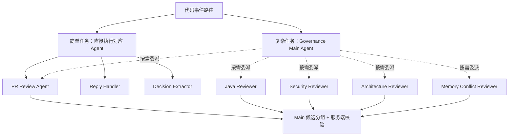

# Pi Repository Governance Agent — Architecture

版本：v0.3｜日期：2026-09-12

> 本文描述系统架构、Agent 分层、工具与副作用边界、输出契约和技术选型。产品范围见 [PRD-MVP.md](./PRD-MVP.md)。

服务沿用一个 Node 进程、一个 PostgreSQL Worker 和固定 SHA Workspace。M2 的独立验收见 [M2](./tasks/M2.md)，M3 的实现与验证见 [M3](./tasks/M3.md)。M2 取舍见 [线程与多 Agent Note](../.agents/notes/proposed/architecture/2026-09-11-m2-reply-and-multi-agent.md)。

M3 的仓库级任务、报告、调度和持久预算取舍见 [Health Auditor Note](../.agents/notes/implemented/architecture/2026-09-12-m3-health-auditor.md)。

## 1. 架构原则

- Pi 是核心 Agent Framework。
- 单个 Node.js / TypeScript 服务承载 GitHub 接入、业务规则和 Pi 执行。
- GitHub 一级事件由确定性代码路由，不让 LLM 决定事件类型。
- 简单任务直接执行对应业务 Agent；只有复杂任务才进入 Main Agent。
- Agent 只获得受控、只读工具；外部副作用统一由服务端执行。
- 当前不引入 Spring Boot、微服务、GraphDB、独立 VectorDB 或复杂工作流平台。

## 2. 系统模块

M0/M1 仅实现对应阶段所需节点；模块数量不等于部署单元数量。

## 3. Agent 层级

### 3.1 核心角色

| 角色 | 输入 | 核心职责 | 结构化输出 | 权限边界 |
| --- | --- | --- | --- | --- |
| Governance Main Agent | 已确定任务类型、上下文索引、预算、可用角色 | 拆解复杂任务、委派、处理缺失结果、综合结论 | 子任务与总体结果、完成范围、局限 | 只读工具 + 受限 delegate_agent |
| PR Review Agent | PR 快照、源码、历史意见、ACTIVE Memory | 判断变更影响、审查、汇总专项发现 | ReviewResult | 只读仓库和 Memory；不直接发布 |
| Reply Handler | App 线程、人类回复、当前代码、原 finding | 验证解释、纠正误判、更新判断 | ReplyResult、决策线索 | 只读；不能激活规则或修改代码 |
| Decision Extractor | 已合并 PR、最终代码、讨论、现有 Memory | 提取可复用决策、分类、定作用域、识别冲突 | DecisionProposal[] | 只能提交候选；不能直接激活 |
| Health Auditor | 固定快照、规则、CI / 测试 / 扫描数据 | 发现仓库层面问题与趋势 | HealthReport | 只读；不修复、不清理 |

Repository Curator 仅保留在长期构想，不属于当前实现。

## 4. Main Agent 何时出现

一级路由由代码根据 GitHub 事件和 action 确定。

简单任务：

- PR Review → PR Review Agent。
- PR Merge → Decision Extractor。
- Review Thread Reply → Reply Handler（M2）。
- 定时健康检查 → Health Auditor（M3）。

只有任务需要多个专项独立分析、交叉核实或跨维度汇总时，才进入 Governance Main Agent。

Main Agent 不负责：

- Webhook 验签。
- 定时调度。
- 任务持久化。
- GitHub 权限判断。
- 重试与幂等。
- Memory 生效。

PR Review Agent 自己负责审查结果汇总，不再额外创建只负责转述的 Aggregator Agent。

## 5. 专项 SubAgent

M1 使用单个 PR Review Agent。M2 的独立角色复用只读文件工具，不加载待审仓库 Skills。

M2 在实际任务复杂度证明有价值后，才拆为独立会话：

| 专项角色 | 关注范围 | 独立会话条件 |
| --- | --- | --- |
| Java Reviewer | Java 语义、异常与资源管理、并发、框架使用 | Java 变更复杂或需要独立上下文 |
| Security Reviewer | 权限、敏感信息、输入处理、攻击面 | 涉及登录、权限、数据出口等安全边界 |
| Architecture Reviewer | 模块边界、依赖方向、架构规则 | 跨模块改动或命中架构决策 |
| Memory Conflict Reviewer | 规则适用性、例外、历史替代关系 | 存在多条可能冲突的团队规则 |

定义：

- **Skill**：审查方法与领域知识。
- **Tool**：受控的可执行能力。
- **Agent**：承担任务并持有上下文的执行角色。

增加审查方法，不等于必须增加 Agent。

## 6. Pi 承载方式

项目默认使用独立 AgentSession 实现角色间上下文隔离，必要时再使用独立进程。

注意：独立 Session 或进程不等于安全沙箱。

delegate_agent 约束：

- 仅允许服务注册的角色。
- 子任务继承当前 Job 的仓库和工作区。
- 不允许模型指定其他仓库、任意文件系统路径、凭据或更高权限。
- 子任务共享父任务总预算。
- 支持超时、并发限制和取消传播。
- 当前固定一层：Main → reviewer；child 不再 delegate，同时最多两项。
- 子 Agent 失败时可返回部分结果，但汇总必须说明缺失维度。

Main 不重复完整审查，最终返回 summary 与候选 key 分组。服务验证每个候选恰好出现一次、Memory 约束不被混合，再合并原始证据。Main 失败时仅可明确汇总已校验 child，并记录 partial/fallback。

## 7. 工具与副作用边界

| 能力 | 实施方式 | 是否暴露给分析 Agent |
| --- | --- | --- |
| read_file / search_text | 绑定当前 Workspace 的只读文件工具；Health 额外限定选定文件与返回行数 | Review / Reply / Specialist / Health |
| git_diff / git_log / git_blame | 有真实需要后再实现 | 当前未注册 |
| PR / diff / thread 读取 | 服务准备绑定 Job 的上下文 | 通过输入上下文提供 |
| Memory 检索 | 服务端附加仓库、Scope 和状态过滤 | 通过输入上下文提供 |
| memory_propose | 结果处理器验证后保存 DecisionProposal | 否 |
| delegate_agent | 白名单角色、继承 Job 范围和预算 | 仅 Main |
| Git clone / fetch / checkout | 服务端准备工作区 | 否 |
| github_create_review / reply_comment | Publisher 校验后执行 | 否 |
| memory_activate / supersede / deprecate | 管理 API 权限校验后执行 | 否 |
| edit / write / git_push / create_pr | 当前阶段不提供 | 否 |

源码只读不意味着系统无写操作；GitHub 评论、任务记录和候选 Memory 均属于服务端受控副作用。

## 8. 输出契约

### 8.1 ReviewResult

下述身份与 fingerprint 由服务封装，不接受模型提供。模型只返回 summary、findings、coverage、limitations；finding 的可选 null 字段规范化为未提供后再校验。

至少包含：

- `job_id`
- `repository_id`
- `pr_number`
- `base_sha`
- `head_sha`
- `summary`
- `coverage`
- `findings`
- `limitations`

每条 finding 至少包含：

- 稳定标识 / 去重指纹。
- 类别和严重度。
- `path`、`line`、`side`；不能映射至 diff 时使用摘要位置。
- 问题说明、触发条件、影响和建议。
- 代码证据。
- 可选 Memory ID、版本和来源。
- 证据充分程度。
- 需要人工确认的事项。

### 8.2 ReplyResult

包含：

- 对应 finding / thread。
- 复核结论。
- 证据。
- 建议状态。
- 决策线索。

### 8.3 DecisionProposal

包含 [memory-design.md](./memory-design.md) 定义的 Memory 核心字段和来源证据。

### 8.4 HealthReport

`HEALTH_AUDIT` 是仓库级 Job，`pr_number`、`base_sha`、`delivery_id` 均为空，不进入 Review publication 或 Reply 状态机。服务在创建任务时固定默认分支 SHA、30 天窗口和路径／语言／预算配置；重试保持这些值。

报告结构见 [HealthReport 类型](../src/types.ts)，执行与校验入口见 [health.ts](../src/health.ts)。报告包含 Job／仓库／SHA、窗口、采集／完成时间、实际 Scope、模型／usage／耗时、各维度 findings、实际读取行数、提供的 Memory 版本、CI 来源、missingData、limitations 和可比性指纹。

模型只输出 summary、findings 与 limitations。finding 的身份、报告归属、覆盖统计、来源链接与状态由服务生成。代码引用必须指向工具实际返回过的行，CI 与 Memory 引用必须属于本次输入。没有有效结构化结果时失败；数据或覆盖不完整时保存 partial。报告与 Job 终态在同一事务提交，重复保存以首次报告为准。

Health 独立使用一个 Session。默认分支后续更新不取消固定旧 SHA 的历史检查；暂停、授权撤销、服务停止及总时限会取消它。GitHub 读取、Git 和文件工具均接收同一取消信号。当前总时限最多 120 秒；单 Worker 不抢占正在执行的健康任务。

定时配置为 off / daily / weekly，默认 off；进程每 30 秒检查到期仓库。数据库仓库行锁与活动任务唯一索引合并重复触发；定时游标与入队在同一事务推进，停机漏过的多个周期只触发一次当前检查。无法建立快照时记录仓库级错误并推进到下一周期，用户可以手动重试。

趋势按相同仓库、范围、采样／检查版本、模型、窗口长度与 Memory 版本筛选；每个维度再检查数据完整性。只展示观察数量和严重度分布，不自动认定问题已修复。管理 API 从最近 20 个优先匹配相同指纹的历史候选中选择可比较报告。

管理 API 沿用 OAuth / CSRF 与仓库维护权限：

| 请求 | 输入与结果 |
| --- | --- |
| `POST /api/repositories/:id/health` | 空对象；返回 202 与新建／已有活动 Job，不接受自选 SHA 或窗口。 |
| `PATCH /api/repositories/:id/health-schedule` | `schedule=off/daily/weekly`；返回仓库配置和下次执行时间。 |
| `GET /api/health?repositoryId=:id&page=0` | 按仓库筛选，每页最多 50 项任务摘要和下一页编号。 |
| `GET /api/health/:jobId` | Job、报告、累计 usage、上次报告标识与各维度比较；报告未生成时为 null。 |
| `POST /api/health/:jobId/retry` | 空对象；仅重排无报告且已失败／超时／取消的任务，保留原快照和剩余预算；冲突或额度耗尽返回 409。 |

这些入口都不创建 GitHub 评论、Issue 或源码提交，也不激活 Memory。

## 9. 结果校验

服务端必须在发布或写入前校验：

- 结构合法性。
- 字段完整性。
- repository / PR / Memory 资源归属。
- diff 行位置。
- Memory 状态和版本。
- 重复 finding。
- 最低证据要求。

格式校验失败可允许一次有限格式修复；仍失败则任务失败，不直接发布原始模型文本。

结构合法不代表判断正确；内容质量由人工标注样本评估。

## 10. 技术选型

| 层 | 初期选择 | 扩展条件 |
| --- | --- | --- |
| Runtime | Node.js + TypeScript | 固定受支持版本和锁文件 |
| Agent | Pi Agent SDK、AgentSession、自定义 Tools / Skills | M2 加入 delegate_agent 与专项会话 |
| GitHub | GitHub App + 原生 fetch | 线程详情需要时补 GraphQL |
| HTTP | Node HTTP 或轻量 HTTP 框架 | 按 Webhook / 管理 API 需求确定 |
| Job | M0 内存；M1 PostgreSQL + 单实例后台执行 | 多 Worker 后再考虑 BullMQ + Redis |
| Memory | PostgreSQL + 作用域过滤 + 文本检索 | 召回不足时加 pgvector |
| Workspace | Git 固定提交快照、Agent 只读 | 运行不可信代码时才引入沙箱 |
| Frontend | React 最小管理界面 | M2/M3 随功能扩展 |
| 部署 | 单 Node 服务 + PostgreSQL | 吞吐 / 隔离需求出现后拆 Worker |

## 11. 阶段性架构门槛

### M0

GitHub App → Webhook → Event Dispatcher → Pi PR Review Agent → GitHub COMMENT Review。

要求：验签、最小权限、固定代码快照、显式只读工具。

### M1

补齐：Decision Extractor、Memory Manager、最小管理界面、持久任务处理、结果校验、去重和恢复。

### M2

补齐：Reply Handler、Main Agent、delegate_agent、专项 Agent、预算与取消传播。

### M3

补齐：Health Auditor、定时 / 手动触发、健康报告与趋势。
