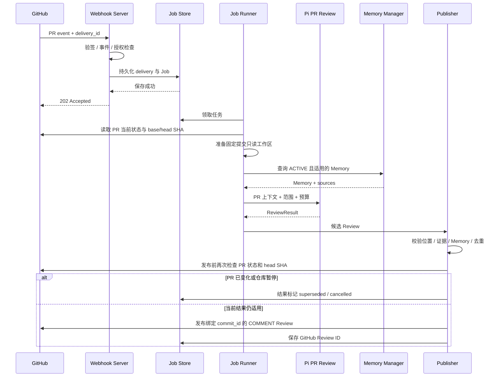

# Pi Repository Governance Agent — GitHub Integration

版本：v0.2｜日期：2026-09-11

> 本文定义 GitHub App、Webhook、事件映射、PR 上下文读取、Review 发布和权限要求。产品范围见 [PRD-MVP.md](./PRD-MVP.md)。

## 1. 接入方式

当前唯一接入平台：GitHub。

运行身份：GitHub App installation access token。

不使用个人 PAT 作为产品运行身份。

Node.js / TypeScript 服务负责：

- GitHub App Webhook 接收。
- 请求体验签。
- installation / repository 归属判断。
- 原生 fetch 调用 GitHub REST API。
- GitHub Review 发布。
- Token 获取与刷新。

Pi 只负责收到确定任务后的推理和工具调用。

## 2. GitHub App 最小权限

| 权限 | 核心 MVP | 用途 |
| --- | --- | --- |
| Metadata | Read | 仓库基础信息 |
| Contents | Read | 获取源码与提交 |
| Pull requests | Read & Write | 读取 PR、发布 COMMENT Review、后续线程回复 |
| Actions / Checks | 默认不申请 | M3 如需读取 CI / Check 再补只读权限 |
| Security alerts | 默认不申请 | M3 如需读取现有安全扫描结果再评估 |
| Contents Write | 不申请 | 当前无代码写入需求 |

服务端固定发布 COMMENT，不让模型选择 APPROVE、REQUEST_CHANGES 或 merge。

Pull requests Write 权限仅用于 Review / 评论，不构成代码写入授权。

## 3. 仓库接入

维护者安装 GitHub App，并选择授权仓库。

系统保存：

- installation 归属。
- repository 归属。
- 仓库启停状态。
- include / exclude paths。
- 语言与预算配置。

只有同时满足以下条件才创建治理任务：

- App 已安装。
- repository 在 installation 授权范围内。
- 仓库治理已启用。
- 当前事件类型受支持。

App 卸载、授权仓库移除或仓库暂停后，停止创建新任务，并取消尚未发布的相关结果。

## 4. Webhook 验签与响应

请求接收流程：

```text
GitHub
  ↓ Webhook
Raw HTTP Body
  ↓ HMAC Signature Verify
Event + Action + Installation + Repository Validation
  ↓
Persist Delivery / Job
  ↓
202 Accepted
```

要求：

- 使用原始请求体进行签名验证。
- 不允许先改写 JSON 再验签。
- 支持的合法事件在持久化后快速返回 2XX / 202。
- 无关但合法事件可直接成功忽略。
- 模型执行、clone/fetch 和远程源码读取全部在响应之后进行。

GitHub 要求 Webhook 在 10 秒内返回 2XX；项目试用目标为 P95 < 3 秒。

## 5. 事件映射

| 输入 | 条件与规则 | 任务 | 阶段 |
| --- | --- | --- | --- |
| `pull_request.opened` | 仓库启用，非 Draft | PR Review | M0 |
| `pull_request.reopened` | 当前仍打开，非 Draft | PR Review | M0 |
| `pull_request.synchronize` | 获取最新 head | PR Review | M0 |
| `pull_request.ready_for_review` | PR 当前可审查 | PR Review | M0 |
| `pull_request.converted_to_draft` | 取消待发布自动审查 | 确定性状态处理 | M1 |
| `pull_request_review_comment.created` | 人类回复本 App 行内线程 | Reply Handler | M2 |
| `pull_request.closed` | `merged=true` | Decision Extractor | M1 |
| `pull_request.closed` | `merged=false` | 仅关闭相关任务 | M1 |
| 定时 / 手动检查 | 仓库启用且操作已授权 | Health Auditor | M3 |
| App 停用 / 卸载 / 移除仓库 | 更新接入状态并停止任务 | 确定性状态处理 | M1 |

一级事件类型和 action 由代码明确处理，不由 LLM 决定。

## 6. PR Review 上下文

PR Review Agent 的上下文由服务端准备。

至少包含：

- PR number。
- PR title / description。
- base SHA。
- head SHA。
- 完整文件变更清单。
- diff。
- 必要源码。
- 必要历史提交 / blame / log。
- 此前本 App 的 Review 结果。
- 当前作用域匹配的 ACTIVE Memory。

工作区必须绑定固定 commit，不允许 Agent 在执行期间静默漂移到新的 HEAD。

## 7. Review 时序



## 8. Review 发布

发布对象：GitHub Pull Request Review。

固定：

- Review event = `COMMENT`。
- 显式绑定 `commit_id`。
- 行内 finding 使用 GitHub 支持的 `path`、`line`、`side`。

发布前服务端校验：

- PR 仍打开。
- 非 Draft。
- repository 仍启用。
- 当前 head 仍等于 ReviewResult.head_sha。
- finding 行位置确实属于目标 diff。
- 引用的 Memory 仍存在且有效。
- 不与已有发布记录重复。

无法可靠映射到 diff 的 finding 放入 Review summary，不猜测行号。

## 9. 新提交处理

`pull_request.synchronize` 到来时：

- 读取最新 head SHA。
- 同 PR 中尚未执行的旧 head Review 可标记 superseded。
- 正在运行的旧 Review 尽力取消。
- 发布前必须再次检查 head SHA。
- 如果旧任务作废且最新 head 没有有效任务，则补建最新 head Review Job。

同一个 PR 的 Review 发布串行执行。

## 10. Review Thread 回复（M2）

Reply Handler 只处理：

```text
pull_request_review_comment.created
```

且必须满足：

- 评论属于本 App 创建的行内 Review 线程。
- 作者是人类，不是本 App 自己。
- 不把普通 PR 会话区 `issue_comment` 自动当成对 AI 的回应。

忽略自身和其他机器人回复，防止循环。

M2 只信任数据库已绑定的 root comment ID，隐藏 pi-finding 标记只用于发布后的映射。source comment 有持久业务幂等；已接收回复按 GitHub created_at 与 comment ID 处理，迟到旧回复不能回退较新结论。

Reply 执行前重读 PR head，发布前再复核。head 变化时重排同一 source comment；closed、Draft 或仓库暂停时取消。FIXED / MISJUDGMENT / VALID_EXCEPTION / STILL_VALID / NEEDS_CLARIFICATION 映射到 finding 状态，例外只形成 decision clue。

Review 发布成功后，comment ID 映射失败单独标记 binding incomplete，保留 published。线程回复网络结果不确定时进入 uncertain，不盲目重发。具体证据与剩余验收见 [M2](./tasks/M2.md)。

## 11. Merge 后 Decision Extractor 上下文

当：

```text
pull_request.closed && merged=true
```

执行 Decision Extractor。

重新读取：

- 最终 PR 内容。
- 人类 Review 评论。
- 普通 PR 会话评论。
- 可获得的线程状态。
- 与本 PR 合并对应的最终代码快照。

即使之前没有运行 Reply Handler，Decision Extractor 也应直接读取可获得的人类讨论。

线程 resolved 状态如需补充，可以通过 GitHub GraphQL 获取；读取失败必须记录为数据缺失，而不是假设已 resolved。

## 12. GitHub 读取工具

Agent 不直接持有任意 GitHub Client。

建议暴露绑定当前 Job 范围的只读适配器：

- `github_get_pr`
- `github_get_diff`
- `github_get_thread`
- `github_get_commit`
- `github_get_file`

适配器自动绑定：

- installation。
- repository。
- PR。
- 固定 SHA。

模型传入的 repository_id、URL 或 PR number 不能突破服务端 Job 范围。

## 13. GitHub 写操作

不直接暴露给分析 Agent：

- create review。
- reply comment。
- resolve thread。
- merge PR。
- push commit。
- create PR。

当前允许的外部写操作由 Publisher 统一执行，并保存：

- 关联 Job。
- 目标 repository / PR。
- head SHA / commit_id。
- finding fingerprint。
- GitHub Review / Comment ID。
- 发布时间和结果。

## 14. GitHub 接入验收

| 场景 | 通过条件 |
| --- | --- |
| 非授权仓库事件 | 不创建治理任务 |
| Draft PR opened | 不执行 Review |
| Draft → Ready | 创建 Review 任务 |
| Ready → Draft | 取消待发布结果 |
| 同一 delivery 重放 | 不重复创建业务效果 |
| synchronize 到新 head | 旧 head 结果不作为最新结论发布 |
| Review 行无法定位 | 放入 summary，不伪造行号 |
| PR merge | 触发 Decision Extractor |
| PR close without merge | 不生成正式 Memory 候选 |
| App 卸载 / 仓库授权移除 | 停止后续任务和发布 |
