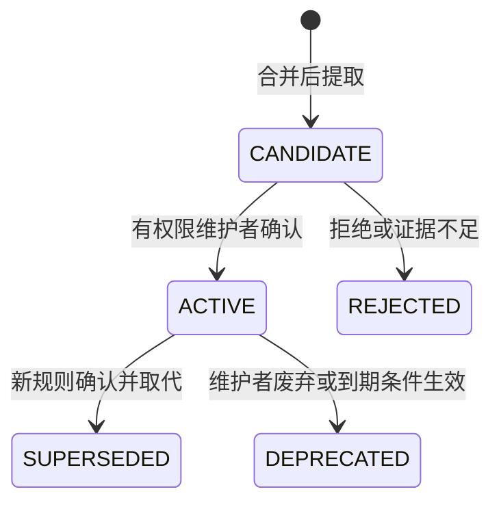

# Pi Repository Governance Agent — Memory Design

版本：v0.1｜日期：2026-09-10

> 本文定义 Team Memory 的数据模型、生命周期、作用域、检索、冲突与 Session 边界。产品目标见 [PRD-MVP.md](./PRD-MVP.md)。

## 1. Memory 的职责

Team Memory 用于保存经确认、可复用、可追溯的长期工程知识。

它不是：

- Agent 的聊天历史。
- 单次 Job 的上下文缓存。
- 任意代码事实的自动摘录。
- 模型高 confidence 输出的自动规则。

Memory Manager 是公共业务模块，负责：

- 保存。
- 检索。
- 权限与仓库边界。
- 状态流转。
- 版本管理。
- 替代与废弃。

Agent 负责理解和提出候选；服务端负责候选是否允许生效。

## 2. Memory 来源

正式候选默认由已合并 PR 触发的 Decision Extractor 产生。

触发条件：

```text
pull_request.closed && merged=true
```

读取：

- 最终代码变更。
- PR 描述。
- Review 意见。
- 人类讨论。
- 可获得的线程状态。
- 与本次合并对应的可靠代码快照。

必须覆盖 merge、squash、rebase 等合并方式；无法还原可靠快照时标记证据不足。

不能使用“稍后默认分支 HEAD”代替该 PR 的真实合并结果。

## 3. 可提取的决策类型

- `architecture_decision`
- `engineering_rule`
- `security_rule`
- `coding_rule`
- `exception`
- `deprecated_pattern`

每条候选必须回答：

1. 决策是什么？
2. 为什么做出？
3. 哪些仓库、路径、模块、语言或条件适用？
4. 哪条人类讨论支撑它？
5. 哪个代码位置支撑它？
6. 它是通用规则、局部例外还是一次性实现选择？
7. 是否与已有规则重复、冲突或构成替代？

不提取：

- 寒暄。
- 重复意见。
- 未定论猜测。
- 仅凭当前代码形式推断出的“团队规定”。

PR 合并或线程 resolved 只能作为上下文证据，不能单独证明形成了通用团队共识。

## 4. Memory 数据模型

| 字段 | 含义 |
| --- | --- |
| id、version | 规则稳定标识与版本 |
| team_id、repository_id | 团队归属与仓库边界 |
| type、title、content、rationale | 类型、标题、规则正文、决策理由 |
| scope | 仓库、路径、语言、模块、适用条件 |
| source | 来源 PR、评论 ID / URL、提交 SHA、提取时间 |
| evidence | 人类讨论与代码依据，注明明确证据或推断 |
| confidence、uncertainties | 模型自评和不确定因素，不代表校准正确率 |
| status | CANDIDATE / ACTIVE / SUPERSEDED / DEPRECATED / REJECTED |
| exception_to、expires_at | 例外对应原规则和可选到期时间 |
| supersedes、superseded_by | 替代关系 |
| approved_by、approved_at | 生效确认者和时间 |
| created_at、updated_at | 创建和更新时间 |

示例：

```yaml
id: MEMORY-038
version: 1
team_id: <team-id>
repository_id: <repository-id>
type: coding_rule
title: Java DTO 字段不使用 Optional
content: 对外接口的 Java DTO 字段不使用 Optional 类型。
rationale: 保持序列化行为和接口表达一致。
scope:
  paths: [backend/**/dto/**]
  languages: [java]
source:
  pull_request: 382
  comment_url: <human-decision-comment-url>
  commit_sha: <verified-merged-snapshot-sha>
evidence:
  - <reviewer-explicit-decision>
  - <matching-final-code-location>
confidence: 0.92
uncertainties: []
status: CANDIDATE
exception_to: null
expires_at: null
supersedes: null
superseded_by: null
approved_by: null
approved_at: null
```

## 5. 状态流转



规则：

- 模型 confidence 再高也不能绕过 CANDIDATE → ACTIVE 的人工确认。
- SUPERSEDED 和 DEPRECATED 记录保留用于追溯。
- 新规则激活和旧规则替代应作为一致状态更新，避免同时检索出两条互相冲突的 ACTIVE 规则。
- REJECTED 保留来源和拒绝结果，但不能作为现行团队要求。

## 6. 作用域

Memory 必须有明确 scope。

可包含：

- team。
- repository。
- path / path pattern。
- module。
- language。
- framework / technology。
- condition。
- expiration。

初期默认按仓库隔离。

团队级共享规则只有在明确授权的仓库范围内开启，不因为向量相似自动跨仓库引用。

## 7. 例外规则

例外必须：

- 关联原规则 `exception_to`。
- 明确适用范围。
- 可选设置 `expires_at`。
- 保留来源证据。

一次 PR 中接受的例外不会取消整个团队规则。

如果存在未解决规则冲突：

- Review 应明确指出冲突。
- 展示各自来源和适用范围。
- 请求人类判断。
- 模型不能静默选择其中一条成为最终规范。

## 8. 替代与废弃

### 8.1 替代

新规则取代旧规则时：

```text
Old ACTIVE
  ↓
SUPERSEDED

New CANDIDATE
  ↓ maintainer confirm
ACTIVE
```

同时维护：

- `supersedes`
- `superseded_by`

### 8.2 废弃

规则不再使用但不存在直接替代项时，转为 DEPRECATED。

废弃后：

- 继续保留历史。
- 不参与常规 Review 的现行规则判断。
- 可以在历史解释场景中被人工查看。

## 9. 检索流程

M1 使用 PostgreSQL 保存规则、来源和生命周期。

检索顺序：

```text
授权范围
  ↓
repository / team 边界
  ↓
status = ACTIVE
  ↓
scope / path / language / condition
  ↓
内容相关性排序
```

Review 只允许 ACTIVE 且作用域匹配的 Memory 作为团队约定依据。

模型输出中引用的 Memory ID 和 version 必须由服务端再次校验：

- 记录存在。
- 当前用户 / Job 可见。
- repository 匹配。
- status 仍为 ACTIVE。
- version 未过期。
- scope 仍然适用。

## 10. 存储与搜索策略

M1：

- PostgreSQL。
- 普通关系字段表达替代与例外关系。
- 先做作用域过滤和文本检索。

可选后续：

- pgvector 语义召回。

启用 pgvector 的条件：固定评测样本证明文本检索召回不足。

当前不引入：

- GraphDB。
- 独立 VectorDB。
- 独立 BM25 服务。

## 11. Session 与 Team Memory 边界

| Pi Session | Team Memory |
| --- | --- |
| 一次任务中的对话、工具调用和输出 | 经确认的长期工程知识 |
| 随 Job 建立并按需过期 | 按规则生命周期保存 |
| 用于执行、复核和排障 | 用于后续任务检索和引用 |
| 不同事件默认不共享可变上下文 | 不同任务可访问有权限的共同知识 |

同一个 PR 的后续事件也创建新的 Job，通过数据库中的：

- 原 finding。
- 线程历史。
- 最新代码。
- 当前 Memory。

重新构建上下文。

系统不依赖永久存活的聊天 Session。

## 12. 与 Reply Handler 的关系

M2 中，Reply Handler 处理人类对本 App 行内审查线程的回复。

可能产生：

- 原问题已修复。
- 原审查误判。
- 解释成立，属于有限例外。
- 解释与实现不一致。
- 证据不足。

“接受这次解释”只影响当前 finding，不自动修改 ACTIVE 团队规则。

PR 合并后仍由 Decision Extractor 读取最终代码与讨论，再提出 Memory 候选。

## 13. Memory 验收

| 场景 | 通过条件 |
| --- | --- |
| 明确 DTO Optional 决策的 PR 合并 | 生成 CANDIDATE，包含来源、代码证据、作用域和理由 |
| 维护者确认候选 | Memory 转 ACTIVE，并记录确认者和时间 |
| 后续相关 PR 再次违反 | 成功召回并引用该 ACTIVE Memory |
| 规则被替代 / 废弃 / 拒绝 | 不再作为现行团队要求 |
| 类似代码出现在不相关模块 | 不误召回该规则 |
| 其他仓库存在语义类似规则 | 默认不跨仓库引用 |
| 同一来源重复提取 | 不重复新增相同规则 |
| 没有可复用决策 | 允许 DecisionProposal[] 为空 |
