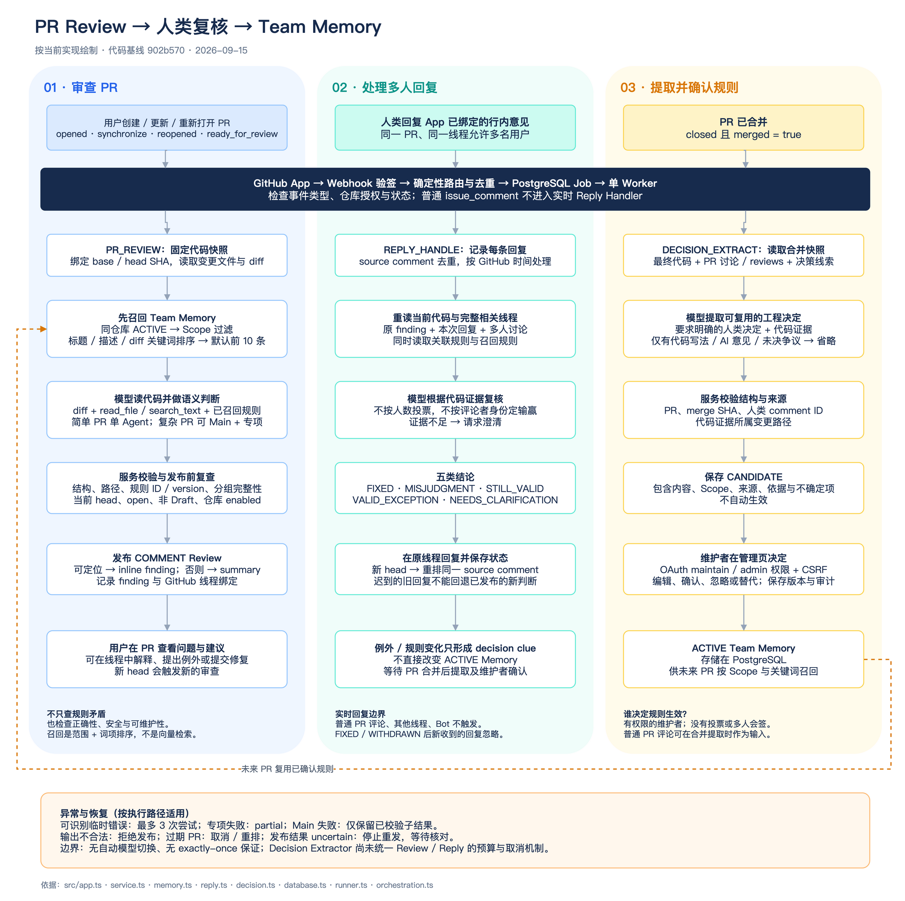

# PR Review、多人回复与 Team Memory 的实际流程

依据代码提交 `902b570`，核对日期：2026-09-16。本文解释当前实现，不把设计目标当作已有功能。

[可编辑 draw.io 流程图](diagrams/pr-review-memory-flow.drawio) · [PNG 预览](diagrams/pr-review-memory-flow.png)

## 1. PR 是怎样被审查的？追加评论会触发吗？

GitHub App 的 Webhook 把事件送到服务。服务验签、校验授权及事件、去重并创建 PostgreSQL Job，单 Worker 执行。opened、reopened、synchronize、ready_for_review 可以触发 PR Review；Draft、关闭、未授权、暂停及不支持的 fork 不进入正常新审查。

### Memory 的召回与语义判断是两步

1. 服务读取固定 base/head SHA 的变更文件、patch 和只读 Workspace。
2. 从同仓库的 ACTIVE Memory 取有效版本，按路径 glob、语言、模块和适用条件过滤。
3. 用 PR 标题、正文、文件路径与 patch 中的词项，对 Memory 的标题、内容、理由做包含匹配计分，默认取前 10 条。零分条目也可能在范围匹配后进入前 10 条。
4. 把召回规则、变更和读取工具提供给模型，由模型理解代码行为，生成 summary 和有证据的 findings。复杂度达到条件时，可以由 Main 委派允许的专项角色。
5. 服务校验结构、变更路径、Memory ID/version 与归属，复查 PR 状态及 head，再发布 COMMENT Review。可映射 diff 的问题形成行内评论，其余降级到摘要。

因此，不是“先生成行为摘要，再拿摘要做向量匹配”。当前没有向量检索、embedding 或独立语义匹配服务；语义判断在 Review 模型内部完成。召回规则数量和 Scope 会影响覆盖面，不能承诺找出所有矛盾。除了规则矛盾，也审查正确性、安全、模块边界与可维护性。

举例：规则要求“查询不能修改共享集合”，变更中出现对内部 List 的原地 sort；词项和 Scope 先决定是否召回规则，模型再追踪代码，判断该 sort 是否确实改变共享状态。

| 用户行为 | 当前处理 |
| --- | --- |
| 人类在本 App 已绑定的 inline finding 线程创建回复 | 创建 REPLY_HANDLE，读取当前代码和相关线程，再在原线程回应。 |
| PR 普通 Conversation 评论、他人的线程、Bot / App 自身回复 | 不触发实时 Reply Handler。普通 PR 评论仍可在合并后的规则提取中被读取。 |
| 编辑或删除已有评论 | 不属于当前仅处理 created 的 Reply 触发范围。 |
| finding 已是 FIXED / WITHDRAWN 后新收到的回复 | 接收层忽略；当前不提供靠新回复重新打开该 finding 的流程。 |

出处：[事件路由](../src/app.ts)、[Review 主链](../src/service.ts)、[Memory 召回](../src/memory.ts)、[Review 模型与工具](../src/review.ts)、[回复接收](../src/database.ts)。

## 2. 能自动从代码抽取 Memory 吗？

**可以自动提出候选，但当前不能仅凭代码把观察结果自动变成有效团队规则。**

触发点是 PR 合并。Decision Extractor 读取固定合并快照、变更文件、普通 PR 讨论、review、行内讨论及已有 decision clue。Prompt 要求同时存在明确的人类工程决定和代码证据；仅有代码写法、AI 意见、寒暄或未决争议应省略。服务还检查结构、PR/SHA 归属、人类评论 ID 和代码证据所属路径。

通过后只保存 CANDIDATE。维护者在管理页编辑、确认、忽略或替代，确认后才成为 ACTIVE，供未来 PR 召回。评论里的有限例外也只是线索，不能直接覆盖有效规则。

这不是全仓库自动学习规范，也不是合并 PR 就必然产生新 Memory。语义证据的充分性仍依赖模型判断与维护者确认，结构校验不等于证明决定正确。

出处：[抽取输入、Prompt 与校验](../src/decision.ts)、[候选持久化](../src/database.ts)、[Memory 生命周期](../src/memory.ts)。

## 3. 多人评论有冲突时，以谁为准？

同一 PR、同一 App finding 线程支持多人回复；不只接受 PR 作者。符合接收条件的人类回复按 source comment 单独去重，保存作者身份。Worker 按 GitHub 创建时间、comment ID 等排序处理；已经发布更新判断时，迟到的旧回复不会回退状态。

**时间顺序只解决处理顺序，不是“最后说话的人正确”。** Reply Handler 接收本次回复、原 finding、完整相关线程、当前代码和关联规则，由模型基于证据判断，可以给出 FIXED、MISJUDGMENT、STILL_VALID、VALID_EXCEPTION 或 NEEDS_CLARIFICATION。

当前没有投票、作者优先、维护者评论自动胜出或多人共识算法。对于意见相反且依据不足的情况，模型可以要求补充说明；系统不会把某个人的发言直接写成 ACTIVE Memory。

规则最终以管理页中具备仓库 maintain/admin 权限的维护者的有效操作为准，记录操作者、版本和审计。系统没有双人审批或维护者之间的仲裁流程；若维护者意见不同，需要团队先形成决定再确认或替代规则。数据库事务保护状态变更，并不代表已实现语义共识。

出处：[线程上下文与复核](../src/reply.ts)、[队列顺序与迟到检查](../src/database.ts)、[维护者权限](../src/admin.ts)、[规则状态转换](../src/memory.ts)。

## 4. 工具失败或运行错误有什么兜底？

| 情况 | 当前措施 |
| --- | --- |
| read_file 读取失败 | 以工具错误返回模型；不能越过 Workspace 边界。模型可据错误调整，但没有保证成功的替代工具。 |
| 被识别为 429、5xx、网络等临时任务错误 | Worker 最多执行 3 次尝试（含首次），按退避或有效 Retry-After 安排；不是所有模型错误都能被识别为可重试。 |
| 模型 JSON、结构、路径或规则引用无效 | 拒绝结果并记录失败，不把错误输出发布成有效结论。 |
| 个别专项失败 | 可保留成功专项结果，明确 partial 与未覆盖范围。 |
| Main 汇总失败 | 若存在有效子结果且任务未取消，服务仅汇总已校验的子结果并标记降级；没有成功子结果则失败。 |
| 超时、预算不足、取消 | Review/Reply 的会话封装限制请求预算及执行时间；Main/child 共享预算与取消。未知 usage 保留为预留消耗。 |
| PR 出现新 head、Draft、关闭或仓库暂停 | 阻止过期结果发布并取消相关活动会话；Reply 因新 head 重排同一 source comment。 |
| 发布结果不确定 | 保存 uncertain，阻止盲目重发；需要核对远端后处理，当前没有完整的自动对账流程。 |
| Review 已发布、线程绑定失败 | 保留 published，标记绑定不完整，不重发整份 Review；尚未绑定的线程不能正常触发自动 Reply。 |
| 服务异常重启 | PostgreSQL 中 running Job 恢复排队，旧 Agent run 标记取消；幂等记录降低重复，但不保证 exactly-once。 |

### 当前限制

- 没有自动切换备用模型或 Provider 的机制。
- Decision Extractor 仍独立创建 Session，有超时及输出校验，但没有复用 Review/Reply 的统一 Token 预算与取消封装。
- 不是所有 PR/Reply 的 GitHub 读取和 Workspace 准备阶段都接入统一的全流程取消／时限；不能声称所有任务路径已经获得相同保护。
- 失败被记录或标记 uncertain，不等于故障已自动修复。设置中的运行记录用于定位问题。

出处：[Worker 重试分类](../src/runner.ts)、[任务状态与恢复](../src/database.ts)、[会话预算](../src/review.ts)、[多 Agent 降级](../src/orchestration.ts)、[发布保护](../src/service.ts)、[Reply 发布](../src/reply.ts)、[抽取路径](../src/decision.ts)。
