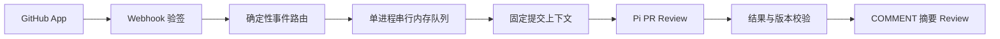

# M0：GitHub → Pi → PR 摘要审查

状态：M0 已完成｜更新：2026-09-10｜完成：9 / 9

本次项目目录、协作规范和 Notes 工具初始化已完成，不计入以下业务任务。勾选框仅在任务满足验收并填写真实证据后更新。

需求来源：
- [PRD-MVP](../PRD-MVP.md)：M0 范围、PR Review、MVP 验收
- [architecture](../architecture.md)：Pi Agent、Job Runner、Workspace、输出契约
- [github-integration](../github-integration.md)：GitHub App、Webhook、事件路由与 Review 发布
- [reliability-security](../reliability-security.md)：验签、幂等、权限和工作区安全

实现依据：[M0 架构决定](../../.agents/notes/implemented/architecture/2026-09-10-m0-pi-github-review.md)。

## 目标与范围

在一个已授权的测试仓库中，创建或更新非 Draft PR 后，服务收到真实 Webhook，通过 Pi SDK 分析固定提交的变更，在同一 PR 发布一份带证据与检查范围的 COMMENT 摘要 Review。

M0 只验证“真实 GitHub 事件 → Pi 分析 → GitHub Review”的技术闭环，不验证团队知识沉淀能力。



M0 只实现一个 PR Review Agent。

M0 不实现：

- 行内评论
- Main Agent
- SubAgent / `delegate_agent`
- Team Memory
- Decision Extractor
- Reply Handler
- PostgreSQL
- Redis / BullMQ
- React 管理前端
- Health Auditor
- Repository Curator
- 冗余代码或文件清理
- 自动修改、修复、提交、推送或合并代码
- 多实例任务调度
- 跨重启任务恢复

本清单将验签、固定提交、只读 Workspace、进程内去重和发布前版本检查纳入 M0 的最小防护。

完整的持久任务、跨重启恢复、多实例幂等、自动补偿与产品化任务管理属于 M1。

## 任务总览

- [x] M0-01：确认依赖版本并建立最小可运行服务
- [x] M0-02：GitHub App 配置与 installation 认证
- [x] M0-03：Webhook 验签与快速接收
- [x] M0-04：确定性路由与串行内存任务执行
- [x] M0-05：固定提交的只读仓库上下文
- [x] M0-06：Pi PR Review Agent 与结构化输出
- [x] M0-07：校验并发布 COMMENT 摘要 Review
- [x] M0-08：本地行为验证与失败路径检查
- [x] M0-09：真实 GitHub 闭环演示与交接

建议顺序：01 → 02 → 03 → 04 → 05 → 06 → 07 → 08 → 09。

M0-08 的检查随对应模块实现同步补充，最后集中运行一次。

M0-02 的外部配置未就绪时，可以先推进使用本地替身的 M0-03～08；但没有真实 GitHub App 与真实模型联调时，M0 不能标记完成。

## M0-01｜最小运行入口

**依赖：**无。

**任务：**

- 复用根目录已有 `package.json`，加入当前链路实际需要的 TypeScript、Pi SDK 和 GitHub 适配依赖。
- 安装前核实 Pi SDK 的实际包名、版本和该版本 API，再锁定依赖；不直接依赖未经确认的 `main` 分支示例。
- 延续单 Node.js / TypeScript 服务，建立一个启动入口和必要配置读取。
- 只创建当前 M0 链路实际使用的模块和目录，不提前创建 M1/M2/M3 空实现。
- 建立 `dev`、`build`、`test` 命令；保留已有 `check:docs`。
- 不同时引入多套包管理器、测试框架或配置体系。
- 提供 `.env.example`，说明：
  - GitHub App ID
  - GitHub App 私钥读取位置
  - Webhook secret
  - 模型名称及对应凭据
  - 服务监听端口
  - 授权测试仓库范围
  - 当前实现实际需要的其他配置
- `.env.example` 不包含真实值。
- 配置缺失或格式错误时启动失败，并明确指出缺少或错误的字段。
- 日志不得回显私钥、token、Webhook secret 或模型凭据。

**验收：**

- 项目可构建。
- 服务入口可启动和停止。
- 无效配置产生确定失败结果。
- 依赖锁文件存在。
- README 只列实际存在并验证过的命令。

**完成证据：**2026-09-10 完成。锁定 `@earendil-works/pi-coding-agent@0.85.1`、`typebox@1.3.7`、`typescript@7.0.2`，生成 `package-lock.json`。`npm run build` 通过；配置成功与缺失/错误分支由 `npm test` 验证。README 与 `.env.example` 只列实际入口。当前目录不是 Git checkout，因此没有可记录的本项目 commit SHA。

## M0-02｜GitHub App 与认证

**依赖：**M0-01；用于测试的 GitHub 仓库和 GitHub App 配置。

**任务：**

- 创建或配置 GitHub App，并安装到指定测试仓库。
- M0 最小权限：
  - Metadata：Read
  - Contents：Read
  - Pull requests：Read & Write
- 订阅 `pull_request` 事件。
- 配置 HTTPS Webhook URL 和 secret。
- 本地演示允许使用已有可用隧道；实际地址和启动方式记录到 README，不硬编码到业务代码。
- 通过 GitHub 适配层生成 installation access token，并验证 App 对指定测试仓库和测试 PR 的读取能力。
- token 与私钥只由服务端持有，不写入：
  - clone URL
  - Prompt
  - 普通日志
  - Workspace 文件
  - Git 提交
- 不使用个人 PAT 作为产品运行身份。
- README 记录：
  - GitHub App 安装步骤
  - Webhook 配置
  - 凭据存放方法
  - 如何撤销测试接入
- 不提交任何真实 secret。

**验收：**

- 能以 GitHub App installation 身份读取指定测试仓库及测试 PR。
- 错误 installation 被拒绝。
- 未授权仓库被拒绝。
- 凭据失效时给出明确错误。
- 服务不会静默切换到其他身份。

**完成证据：**2026-09-10 完成。App `4897032`（slug `pi-governance-agent-dev`）通过 JWT 获取 installation `160592861`；installation repository 列表包含且仅包含 `M2tHane/pi-review-test-repository`。真实 token 成功读取 PR 与固定 Git 快照，服务没有 PAT 回退。Webhook 配置为 JSON、TLS 校验开启，只订阅 `pull_request`。最终远端复核确认 App 与 installation 权限均仅为 `Contents: Read`、`Metadata: Read`、`Pull requests: Write`，没有额外 Checks 权限。

## M0-03｜Webhook 接收

**依赖：**M0-01；真实联调依赖 M0-02。

**任务：**

- 提供：

```text
POST /github/webhook
```

- 使用原始请求体和 GitHub 签名验证来源，再解析 JSON。
- 对以下内容做明确校验：
  - 请求体大小
  - 必需 header
  - 签名
  - JSON 格式
  - 当前链路需要的业务字段
- 解析当前 M0 实际使用的：
  - event
  - action
  - `delivery_id`
  - installation
  - repository
  - pull request
- 错误签名、损坏 JSON、超限请求或无法处理的必需字段返回明确非成功状态。
- 这些失败不得调用 Pi 或 GitHub Publisher。
- 支持的合法事件成功进入当前进程队列后快速返回 `202 Accepted`。
- 合法但 M0 不处理的事件或 action 返回成功并忽略。
- 当前进程无法接收任务时不得假装成功。
- Webhook 请求生命周期中不等待：
  - clone / fetch
  - Workspace 准备
  - 模型调用
  - GitHub Review 发布

**验收：**

- 正确签名的合法请求可以接收。
- 错误签名被拒绝。
- 损坏 JSON 被拒绝。
- 超过大小限制的请求被拒绝。
- 上述失败的模型调用次数和发布调用次数均为零。
- 将后台模型替身故意阻塞时，Webhook 仍在 GitHub 要求的 10 秒内响应。
- 记录实际响应耗时。

**完成证据：**2026-09-10 完成。`npm test` 通过正确签名入队、错误签名、坏 JSON、超限、忽略事件及后台阻塞场景；非法输入的后台执行次数为 0。固定样本中阻塞后台任务时响应耗时 4.47 ms，返回 `202 Accepted`。

## M0-04｜路由与内存任务

**依赖：**M0-03。

**任务：**

- 在确定性代码中映射以下 action 到 PR Review：
  - `opened`
  - `reopened`
  - `synchronize`
  - `ready_for_review`
- 不调用 LLM 决定一级事件类型或选择 Agent。
- 进入队列前验证当前任务与 installation / repository 的关系。
- Draft、已关闭 PR、未授权仓库和无关 action 不进入模型执行。
- 使用单实例、单进程、串行内存队列执行 PR Review。
- 每个任务至少记录：
  - `delivery_id`
  - `job_id`
  - `repository_id`
  - `pr_number`
  - 目标 `head_sha`
  - 当前状态
  - 错误摘要
- 当前进程内对相同 `delivery_id` 去重。
- 当前进程内避免已经成功完成的相同：

```text
repository + PR + head SHA
```

再次自动发布相同审查。

- 新 head 到来时，尚未开始执行的旧 head 任务可以直接标记为过期并跳过。
- 正在执行的旧任务无需为了 M0 构建复杂取消框架，但发布前必须再次检查 head。
- 队列设置简单容量上限，防止无限增长；达到上限时明确拒绝新的可执行任务。
- 去重记录必须有简单的有界清理方式，不允许无限增长。
- 失败任务允许通过重新投递事件或重新启动演示流程再次执行。
- M0 不实现通用 Retry API、自动退避平台或复杂任务调度器。
- 任务至少区分实际需要的：
  - `queued`
  - `running`
  - `succeeded`
  - `failed`
  - `timeout`
  - `superseded`
- 未发布成功不能显示为 `succeeded`。

**验收：**

- 两个支持事件按串行顺序执行。
- 相同 `delivery_id` 重复投递时不重复执行。
- 已成功审查的相同 PR/head 不重复自动发布。
- Draft、未授权仓库和无关 action 不调用模型。
- 新 head 到来后，旧结果不会作为最新结果发布。
- 队列达到容量上限后不会无限接收。
- 失败任务可以通过明确的重新投递流程再次执行。

**已知限制：**

M0 的内存队列和去重状态在进程重启后丢失。

M0 不提供：

- 跨重启恢复
- 多实例一致性
- exactly-once
- 自动补偿
- 通用任务管理 API

README 必须明确说明这些限制。

**完成证据：**2026-09-10 完成。`npm test` 验证确定性路由、串行、delivery/PR-head 去重、容量、失败重投和排队旧 head 淘汰。真实 `opened` delivery `51c28d70-ad11-11f1-8f60-9ef65133b57e` 与 `synchronize` delivery `0e0ddf10-ad13-11f1-8bea-580e9c91c7a4` 分别执行；新 head Review 绑定 `5313be76640bad951d821e93cee7bdd5b230dc02`，旧 Review 仍绑定旧 head。重投 synchronize delivery 后远端 Review 数保持 2。

## M0-05｜源码与 PR 上下文

**依赖：**M0-02、M0-04；开发时可先用本地 Git 样本。

**任务：**

- 获取当前 Review 所需的：
  - PR title / body
  - base SHA
  - head SHA
  - 完整变更文件清单
  - 必要 diff
  - 必要的相关源码
- 远端列表接口需要处理分页。
- API 返回截断、diff 缺失、源码不可获得等情况时必须显式记录。
- 服务负责为每个 Job 创建隔离的临时 Workspace，并定位到固定目标提交。
- Agent 分析的源码必须与目标 `head SHA` 一致。
- 使用与该 PR 一致的比较基线；必要时记录 merge-base。
- 不把 base 分支中与该 PR 无关的后续变化混入审查输入。
- M0 优先支持普通分支 PR。
- Fork PR 只有在能可靠取得固定 head 快照时才支持；无法可靠取得时明确失败或标记当前 M0 不支持，不为覆盖全部 fork 场景阻塞 M0 主闭环。
- 为 Agent 提供当前 Workspace 内的只读读取和搜索能力。
- 不默认把整个仓库全部塞入模型上下文；根据变更按需追踪相关源码。
- Git 操作不得执行待审仓库：
  - hooks
  - 外部 filter
  - 任意可执行配置
- 不执行待审仓库：
  - 构建脚本
  - 测试脚本
  - 包安装
  - 启动脚本
- Workspace 工具必须限制路径范围。
- 路径规范化后不得越出当前 Workspace。
- 符号链接解析后不得读取 Workspace 外部文件。
- 任务成功或失败后都要回收临时 Workspace。
- 清理逻辑只能删除当前 Job 创建的目录，不触碰用户仓库或其他 Job。

**验收：**

- Job 记录的目标 head 与实际读取代码一致。
- 可以读取当前变更依赖的相关源码。
- 路径穿越读取失败。
- 指向 Workspace 外部的符号链接读取失败。
- 代码缺失或 diff 不完整时不会伪装为完整审查。
- 任务结束后临时 Workspace 被正确回收。

**完成证据：**2026-09-10 完成。本地双提交样本和真实 PR #1 均通过。真实 base 为 `98cd7fa345ca0663fdd15120ad6b2774112f2aa7`，head 为 `c422de6b52acb03e840dd2ece4feaf191e6585a7`；Workspace 的 HEAD 与目标一致并读取到 `src/note-store.js`，结束后临时目录被回收。路径穿越和外部符号链接测试通过；GitHub 文件分页和缺失 patch limitation 已实现。普通分支 PR 已验证，fork PR 保持 M0 不支持。

## M0-06｜Pi PR Review

**依赖：**M0-01、M0-05；真实模型调用需要模型凭据。

**任务：**

- 定义一个服务自有的 PR Review Agent。
- M0 只使用这一个 Agent，不拆 Java Reviewer、Security Reviewer、Architecture Reviewer 等专项 SubAgent。
- Agent 主要围绕：
  - 正确性
  - 明显安全问题
  - 架构 / 模块边界
  - 可维护性
- 每个 PR Review Job 创建一次独立 Pi `AgentSession`：

```text
1 Job = 1 AgentSession
```

- 任务结束后释放，不跨 GitHub 事件长期复用 Session。
- 只向 Agent 注册当前 Workspace 所需的受控只读工具。
- 不注册：
  - 任意 shell
  - `edit`
  - `write`
  - `git push`
  - GitHub 写工具
  - Memory 写工具
- 使用受控资源加载。
- 只加载服务自身维护的：
  - Agent Prompt
  - Skills
  - Extensions
  - Tool 定义
- 待审仓库中的以下内容全部作为不可信数据：
  - PR title / body
  - 评论
  - README
  - AGENTS.md
  - `.pi` 配置
  - Skills
  - 源码和源码注释
- 仓库内容不能：
  - 注册新工具
  - 提升权限
  - 更换仓库
  - 更换 PR
  - 更换 SHA
  - 读取 Workspace 外部数据
  - 触发 GitHub 写操作
- 设置有限执行时间和输出预算。
- 超时后终止当前 AgentSession，并将任务标记为失败或超时。
- 记录：
  - 执行耗时
  - 实际模型名称
  - SDK 能直接获得的 token / usage 信息
- M0 不建设成本统计平台或多 Provider 管理系统。
- Agent 返回最小结构化结果：

```ts
interface ReviewResult {
  summary: string;
  findings: Finding[];
  coverage: string[];
  limitations: string[];
}

interface Finding {
  path?: string;
  description: string;
  evidence: string;
  impact: string;
  suggestion?: string;
}
```

- `repository`、`PR number`、`job_id`、`base SHA`、`head SHA` 由服务绑定，不允许模型改写。
- 没有发现时允许 `findings` 为空。
- 分析范围不完整时必须写入 `coverage` / `limitations`。
- M0 没有 Team Memory，因此不能声称：
  - 命中团队规则
  - 引用了历史 Memory
  - 验证了团队约定
- “未发现问题”只表示本次已检查范围内没有产出 finding，不等价于“代码安全”或“检查通过”。

**验收：**

- 能通过真实 Pi SDK 调用返回可解析的结构化结果。
- 至少一个测试样本中的 finding 包含代码证据。
- 恶意 PR 文本不能启用新工具。
- 恶意仓库配置不能读取其他目录。
- 超时后 Session 能终止，任务不会显示成功。
- 无发现场景允许合法返回空 `findings`。

**完成证据：**2026-09-10 完成。`@earendil-works/pi-coding-agent@0.85.1` 以 `1 Job = 1 AgentSession` 调用 `deepseek/deepseek-v4-flash`；仓库资源发现关闭，只注册受限 `read_file`、`search_text`。首次真实结果用 30,525 ms、7,768 tokens，识别 `src/note-store.js` 路径穿越并引用具体代码；第二次用 26,587 ms、7,948 tokens 分析修复 head。1 ms 真实超时实验产生 Job `1c5aa2da-908c-4d57-b3a0-ad6ed70cf740`，状态 `timeout` 且未发布；配置随后恢复为 300 秒。

## M0-07｜GitHub 摘要发布

**依赖：**M0-02、M0-06。

**任务：**

- Agent 结果先进入服务端校验，不允许模型直接调用 GitHub 写接口。
- 服务端验证：
  - 输出结构
  - 当前 Job 归属
  - 引用的文件路径是否属于当前 Workspace / PR
  - 目标 repository / PR / SHA 是否仍与任务一致
- 输出结构不合法时：
  - 记录任务失败
  - 不直接发布模型原始文本
- 服务统一生成 Review body。
- 发布前重新读取 PR 实时状态，并确认：
  - repository 仍在授权范围
  - PR 仍 open
  - PR 非 Draft
  - 当前 head SHA 仍等于目标 `head_sha`
- 若 head 已变化：
  - 旧结果标记为 `superseded`
  - 不作为最新 Review 发布
  - 最新 head 可以由现有事件或补建逻辑进入新任务
- M0 只发布：

```text
event = COMMENT
```

- 显式绑定对应 `commit_id`。
- M0 不发布逐行评论。
- M0 不允许：
  - `APPROVE`
  - `REQUEST_CHANGES`
  - 自动 merge
- Review 摘要至少包含：
  - 检查的目标提交
  - summary
  - findings
  - coverage
  - limitations
- 发布成功后记录 GitHub Review ID / URL。
- 当前进程内抑制同一任务重复发布。
- 若 GitHub 发布请求出现网络异常，无法确定 GitHub 是否已经创建 Review：
  - 不自动立即重发
  - 记录“结果待核对”或等价状态
  - 在 M0 演示中人工查询远端结果后再决定是否重新投递
- M0 不实现完整 reconciliation / exactly-once 发布系统。

**验收：**

- 测试 PR 收到与目标 SHA 对应的一份 COMMENT Review。
- 模型输出中的其他 repository / PR / action 不会改变发布目标。
- 新提交出现后旧结果不会作为最新结论发布。
- GitHub 发布失败不会显示为成功。
- 发布状态不确定时不会盲目重复发送。

**完成证据：**2026-09-10 完成。本地替身确认固定 `event=COMMENT`、`commit_id=head_sha`，并覆盖 403 与发布结果不确定时不盲目重投。真实 Review `5167031392` 绑定 `c422de6b52acb03e840dd2ece4feaf191e6585a7`，URL 为 `https://github.com/M2tHane/pi-review-test-repository/pull/1#pullrequestreview-5167031392`；Review `5167054909` 绑定 `5313be76640bad951d821e93cee7bdd5b230dc02`，URL 为 `https://github.com/M2tHane/pi-review-test-repository/pull/1#pullrequestreview-5167054909`。两者均为 `COMMENTED`，没有行内评论或审批状态变更。

## M0-08｜本地行为验证

**依赖：**M0-03～07；检查随实现同步补充。

优先使用 Node.js 内置测试能力和少量固定样本。

GitHub / 模型使用替身验证确定性行为，不为每次本地测试发送真实评论或消耗真实模型额度。

| 场景 | 必须观察到的结果 |
| --- | --- |
| 正确签名 + 支持的非 Draft PR | Webhook 接收，后台任务执行，生成合法 COMMENT 发布请求 |
| 错误签名、坏 JSON、超限请求 | 请求被拒绝，Pi / Publisher 调用次数均为 0 |
| Draft、closed、未授权仓库、无关 action | 不进入 Pi Review，不发布 Review |
| 重复 `delivery_id` | 当前进程内不重复执行 |
| 已成功的相同 PR/head 等价事件 | 当前进程内不重复自动发布 |
| head 从 A 更新为 B | A 结果不得作为最新结论发布，B 可以进入审查 |
| Workspace 越界读取 | 路径穿越和外部符号链接无法读取 Workspace 外数据 |
| 仓库中的恶意 AGENTS.md / `.pi` / Prompt 文本 | 不注册新工具、不提升权限、不触发外部写操作 |
| 模型输出结构无效 | 校验失败，不发布原始模型文本 |
| Pi 超时 | Session 终止，任务标记为 timeout/failed，不显示成功 |
| GitHub 无权限 | 发布失败并保留明确错误 |
| GitHub 发布状态不确定 | 不盲目重发，进入人工核对 |
| Diff / 源码不完整 | 明确记录 coverage / limitations，或以明确原因失败 |

**验收：**

- 全部当前已实现的本地行为检查通过。
- `build`、`test` 和 `check:docs` 通过。
- 检查可重复运行。
- 关键失败路径能够阻止 GitHub 发布。
- 尚未覆盖的场景必须列出，不得写成已通过。

**完成证据：**2026-09-10 完成。`npm run build`、`npm test`（10 个测试）和 `npm run check:docs` 通过。覆盖 Webhook、队列串行/去重/容量/失败重投/旧 head、Workspace 边界、结构化输出、配置、固定 COMMENT、GitHub 403 和不确定发布；真实链路补充验证 Pi 成功、Pi timeout、固定双 head 与 delivery 重投。目标仓库修复提交运行 `npm test`，4 项通过。

## M0-09｜真实演示与交接

**依赖：**M0-02、M0-08；已获授权用于真实评论的测试 PR 和可用模型。

**任务：**

- 启动真实服务并接入 GitHub Webhook。
- 创建一个授权测试仓库中的非 Draft PR。
- 确认以下链路真实发生：

```text
GitHub pull_request event
→ Webhook
→ 内存任务
→ 固定提交 Workspace
→ Pi AgentSession
→ ReviewResult
→ 服务端校验
→ GitHub COMMENT Review
```

- 推送一个新提交，再验证一次：
  - 新 `head SHA` 被识别
  - 新任务分析对应新提交
  - 旧结果不会作为最新结论发布
- 重投同一 delivery，确认当前进程内不会重复发布。
- 人为制造一次可恢复的演示错误，例如：
  - 临时无效模型凭据
  - 临时 GitHub 权限错误
  - 模型超时
- 记录实际失败表现和恢复方式。
- M0 不要求通用自动恢复平台，允许修复配置后重新投递事件。
- 演示结束后停止临时测试入口 / 隧道。
- README 补齐实际可执行的：
  - 启动步骤
  - 配置说明
  - 测试命令
  - GitHub App 配置
  - 常见错误排查
  - M0 内存队列限制
- 更新本清单中的真实完成状态和完成证据。

**验收：**

- 真实 GitHub Webhook 确实触发 Pi SDK。
- Pi 分析的源码对应目标 PR 的固定提交。
- GitHub 中出现由服务真实发布的 COMMENT Review。
- Review 对应同一 repository、同一 PR、同一目标提交。
- 能从当前任务记录追溯该执行。
- 不是仅依赖：
  - 本地替身
  - 手工调用 Agent
  - 手工调用 GitHub API
  - 手工粘贴评论

**完成证据：**2026-09-10 完成：

- 测试 PR URL：`https://github.com/M2tHane/pi-review-test-repository/pull/1`
- 目标 SHA：首次 `c422de6b52acb03e840dd2ece4feaf191e6585a7`；更新后 `5313be76640bad951d821e93cee7bdd5b230dc02`
- `delivery_id`：opened `51c28d70-ad11-11f1-8f60-9ef65133b57e`；synchronize `0e0ddf10-ad13-11f1-8bea-580e9c91c7a4`；GitHub 均返回 `202`
- `job_id`：成功 `a4147868-6ab5-4442-acfb-08be67011ff8`、`fdb04102-abc0-48e1-9b0c-f8b2f185aa62`；超时 `1c5aa2da-908c-4d57-b3a0-ad6ed70cf740`
- GitHub Review URL / ID：`https://github.com/M2tHane/pi-review-test-repository/pull/1#pullrequestreview-5167031392` / `5167031392`；`https://github.com/M2tHane/pi-review-test-repository/pull/1#pullrequestreview-5167054909` / `5167054909`
- Webhook 响应耗时：公网固定签名连通请求 1726.61 ms；真实 GitHub delivery 状态 202
- Agent 执行时间：30,525 ms；更新后 26,587 ms
- 实际 Pi SDK 版本：`@earendil-works/pi-coding-agent@0.85.1`
- 实际模型名称：`deepseek/deepseek-v4-flash`
- 已知限制：进程重启丢失队列和去重；首次无效模型配置与 Git fetch 认证错误均通过修复配置/代码后重投恢复；App 多余的 Checks 权限仍需人工移除

不得记录真实 secret、token 或私钥。

## 执行记录与完成规则

所有任务默认未开始。

开工时在对应任务的“完成证据”下记录当前进展。

阻塞时写明：

- 缺少的具体输入
- 阻塞的是哪个验收项
- 当前仍可继续的独立工作

完成任务时：

1. 运行该任务对应的实际验证。
2. 在“完成证据”中记录事实。
3. 确认验收项全部满足。
4. 再勾选任务总览。
5. 更新顶部“完成：X / 9”。

证据格式至少包含：

```text
日期
实际命令或操作
通过 / 失败
相关 SHA / delivery / Review 链接
仍存在的限制
```

未运行的检查必须写明“未运行及原因”，不能记为通过。

仅通过本地替身测试，可以完成对应本地开发任务，但不能替代 M0-09 的真实集成验收。

完成 M0 的门槛是：

```text
M0-01 ～ M0-09 全部验收通过
+
真实 GitHub Webhook
→ 真实 Pi SDK
→ 真实 GitHub COMMENT Review
```

没有 GitHub App、授权测试仓库或模型配置时，可以完成独立的本地工作，但不能将 M0 标记为完成。

## 文档收尾

2026-09-10 已同步本文件最终状态和真实证据，README 已更新为实际运行方式，[M0 架构决定](../../.agents/notes/implemented/architecture/2026-09-10-m0-pi-github-review.md) 已迁移至 implemented 并由源码入口反向引用。

M1/M2/M3 的空实现没有提前创建。
